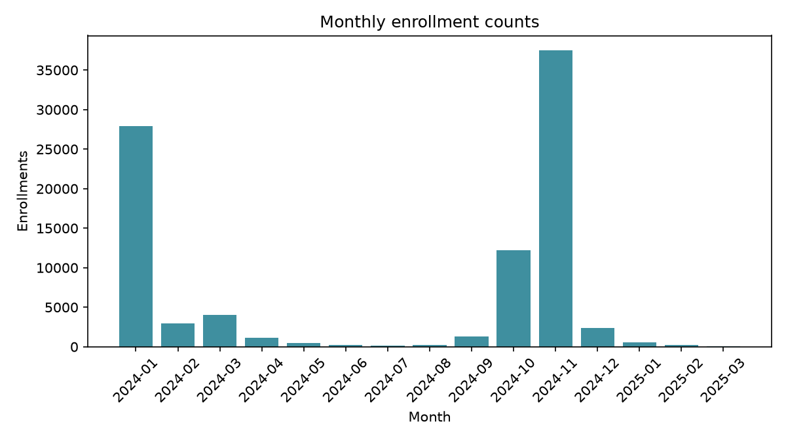
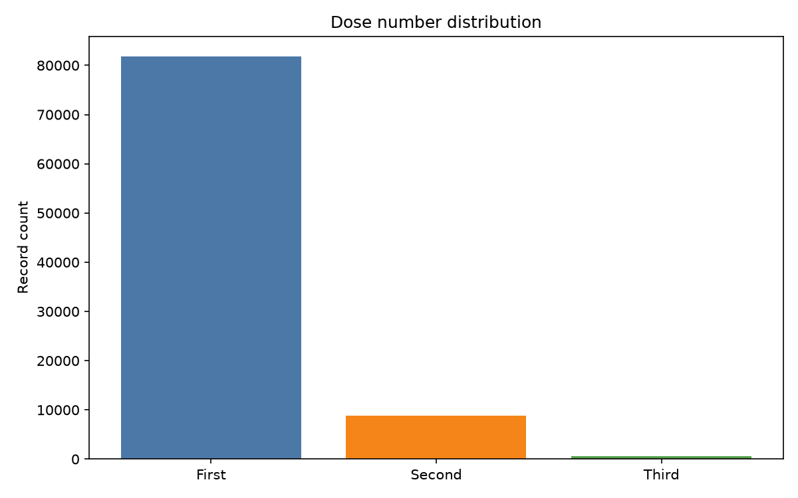

## Available datasets

The workspace includes several CSV files related to vaccination records and surveys:

- `covid_daily_survey.csv`
- `covid_dose_history.csv`
- `covid_enrollment.csv`
- `covid_vaccination.csv`
- `covid_vaccination_old_records.csv`
- `covid_weekly_survey.csv`

## How the analysis data were prepared

The website does not analyze the CSV files separately. It first converts the daily survey into a participant-level table and then joins that table to the vaccination records using `VSAFE_SYSTEM_ID`.

- The daily survey file is cleaned to keep only `yes`/`no` symptom responses.
- A participant-level `symptom_free` variable is created from the daily survey history. It equals 1 only when that participant has no `yes` symptom responses in the available daily rows.
- The participant-level daily table is joined to `covid_vaccination.csv` on `VSAFE_SYSTEM_ID` so age band, dose number, and current health state are available in one analysis table.
- Rows with invalid age values or missing join fields are removed.
- For the main analysis, Fourth and Fifth doses are excluded because they are extremely sparse and would not give stable comparisons.
- Missing key fields are dropped rather than imputed.

### Cleaning summary

```{python}
#| label: tbl-cleaning-summary
#| echo: false

import pandas as pd

age_order = ["0.5-04", "05-11", "12-19", "20-29", "30-39", "40-49", "50-59", "60-69", "70-79", "80+"]
dose_order = ["First", "Second", "Third"]

vax = pd.read_csv("covid_vaccination.csv", low_memory=False)
daily = pd.read_csv("covid_daily_survey.csv", low_memory=False)

daily_clean = daily[["VSAFE_SYSTEM_ID", "HAD_SYMPTOMS"]].dropna().copy()
daily_clean["HAD_SYMPTOMS"] = daily_clean["HAD_SYMPTOMS"].astype(str).str.strip().str.lower()
daily_clean = daily_clean[daily_clean["HAD_SYMPTOMS"].isin(["yes", "no"])].copy()

participant = daily_clean.groupby("VSAFE_SYSTEM_ID").agg(
	symptom_free=("HAD_SYMPTOMS", lambda values: int((values == "no").all()))
).reset_index()

merged = participant.merge(
	vax[["VSAFE_SYSTEM_ID", "age_at_vax_yrs", "DOSE_NUMBER", "CURRENT_STATE"]],
	on="VSAFE_SYSTEM_ID",
	how="inner",
)

merged = merged.dropna(subset=["age_at_vax_yrs", "DOSE_NUMBER", "CURRENT_STATE"])
merged = merged[merged["age_at_vax_yrs"] != "Invalid"].copy()
merged = merged[merged["age_at_vax_yrs"].isin(age_order)].copy()
merged = merged[merged["DOSE_NUMBER"].isin(dose_order)].copy()

cleaning_summary = pd.DataFrame({
	"step": [
		"Daily survey rows after dropping missing symptom responses",
		"Participant-level records created from daily survey",
		"Rows after joining vaccination records",
		"Final analysis sample after removing invalid ages and sparse doses",
	],
	"records": [
		len(daily_clean),
		len(participant),
		len(participant.merge(vax[["VSAFE_SYSTEM_ID"]], on="VSAFE_SYSTEM_ID", how="inner")),
		len(merged),
	],
})

cleaning_summary
```

## Enrollment and vaccination trends

The data shows a sharp spike in enrollment during early 2024 and again toward late 2024, while most records are concentrated in first and second dose activity.

### Enrollment trend chart



### Dose distribution chart



### Summary table

| Metric | Value |
| --- | ---: |
| Enrollment records | 91,379 |
| Vaccination records | 91,216 |
| Daily survey responses | 139,421 |
| Weekly survey responses | 220,416 |
| Most common manufacturer | Pfizer-BioNTech |
| Most common dose | First |

### Interpretation

- Enrollment activity is seasonally uneven, but the dataset is dominated by a small number of intense reporting periods.
- First-dose records account for most vaccination entries, suggesting a large share of the sample is still captured at the initial dose stage.
- The summary table gives a concise snapshot that can be expanded with more participant-level drilldowns later.
