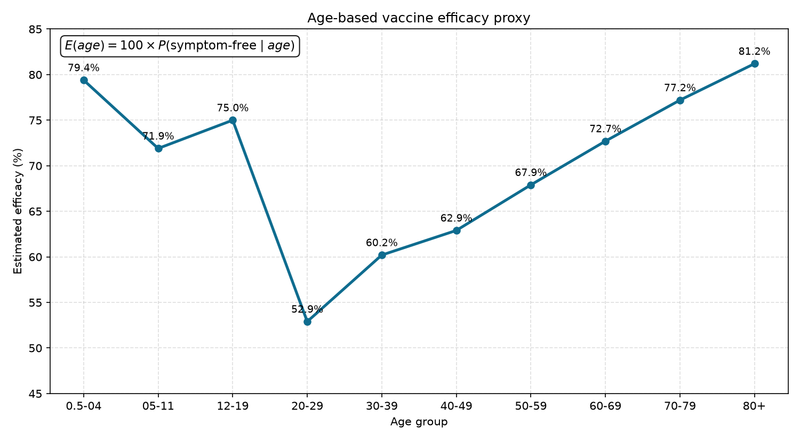
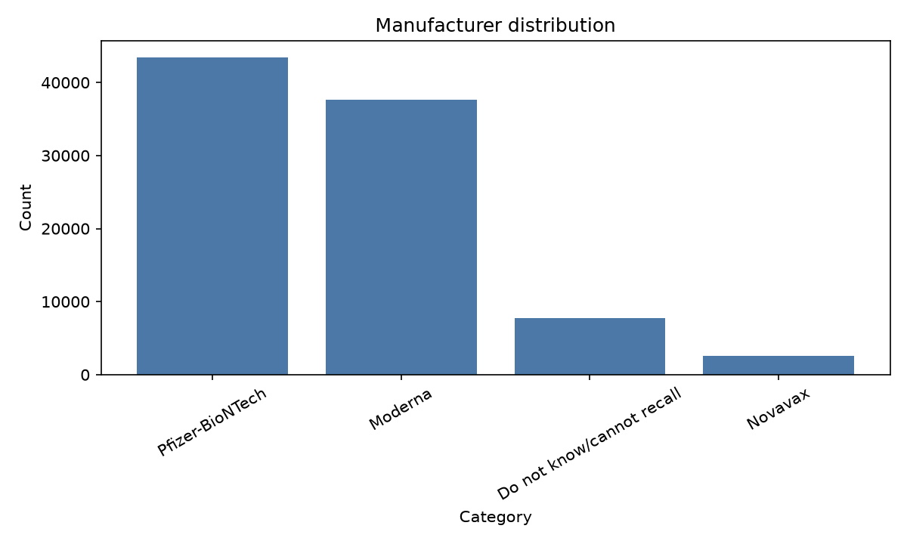
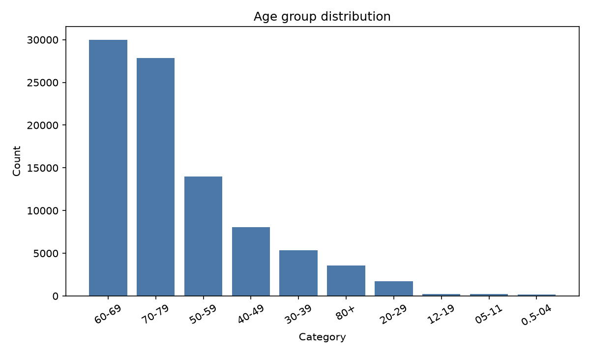
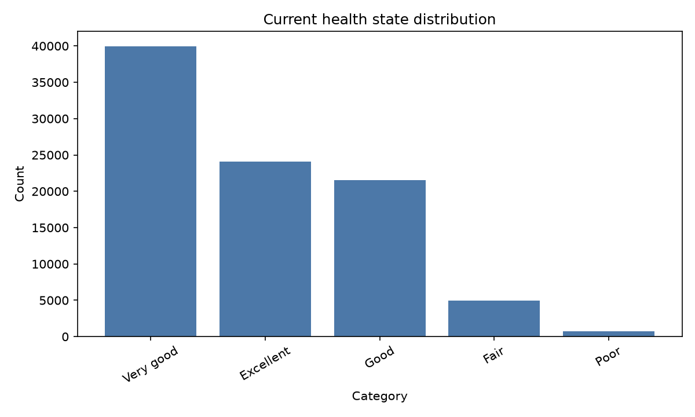
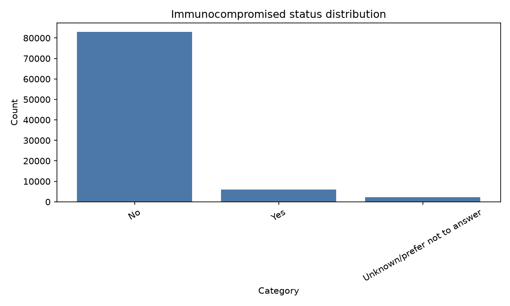
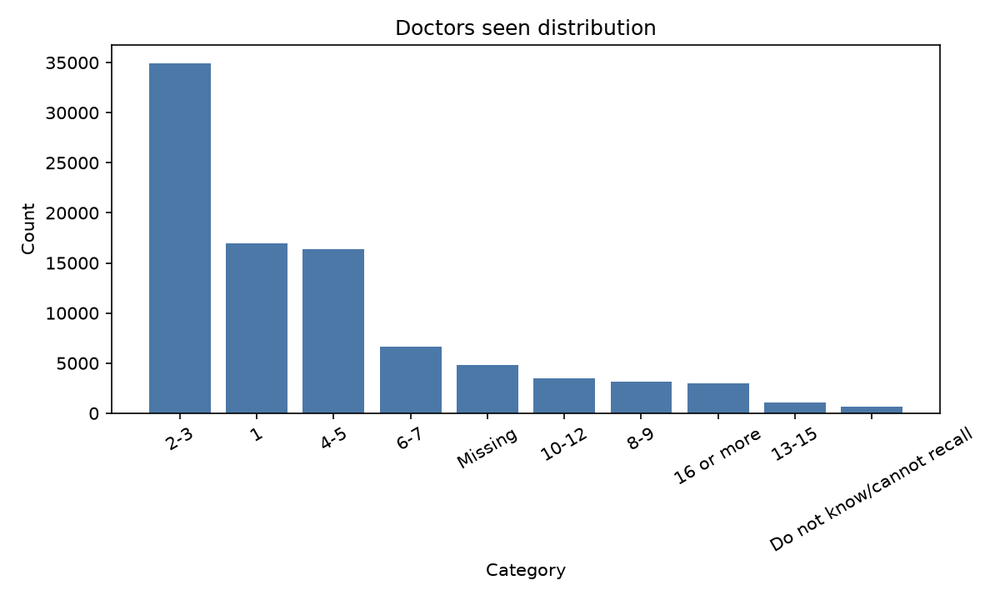
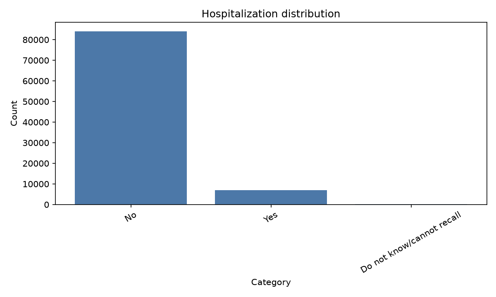
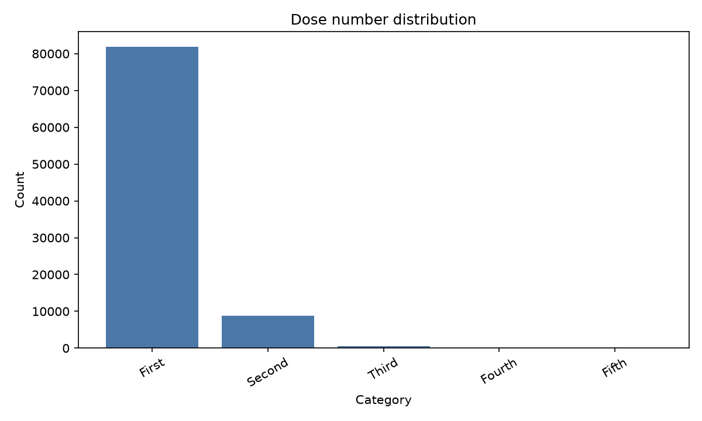
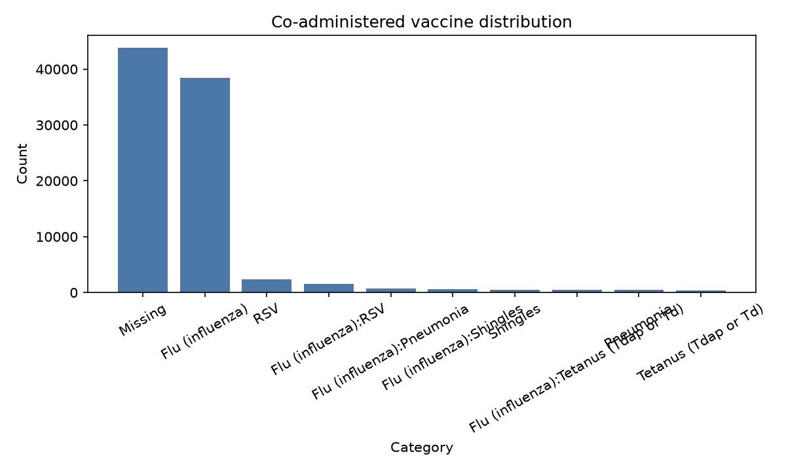

## Covariate graphs

This section contains a small gallery of charts derived from the vaccination and enrollment CSV files. Each image highlights a major covariate in the dataset.

### Age-based vaccine efficacy

This graph shows a simple efficacy proxy, estimated from the share of participants reporting no symptoms in the daily survey after vaccination, grouped by age band.

$$
E(age) = 100 \times P(\text{symptom-free} \mid age)
$$

### Manufacturer distribution

### Age group distribution

### Current health state distribution

### Immunocompromised status distribution

### Doctors seen distribution

### Hospitalization distribution

### Dose number distribution

### Co-administered vaccine distribution

### Notes

- The charts are intended as a lightweight covariate gallery for exploratory analysis.
- The age-based graph uses a symptom-free rate proxy as a practical estimate of vaccine efficacy by age group.
- Further work could add trend lines, statistical summaries, or more advanced subgroup comparisons.
