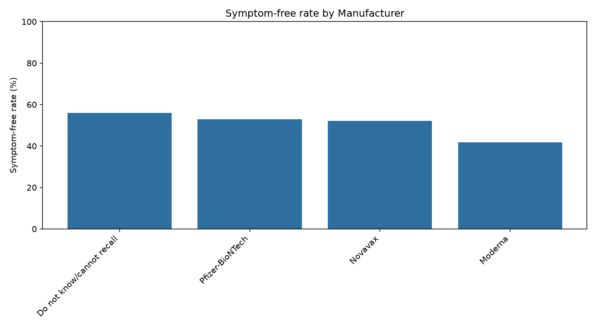
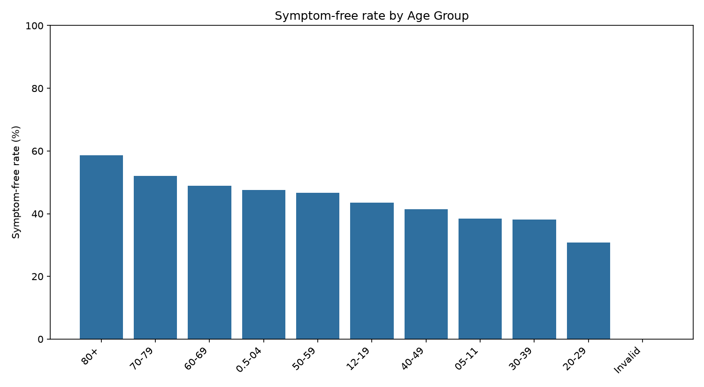
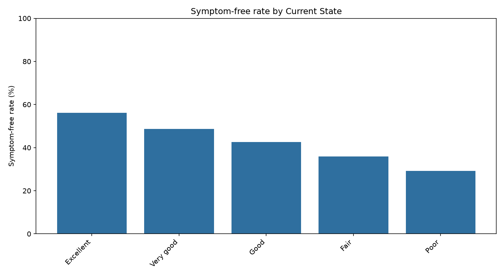
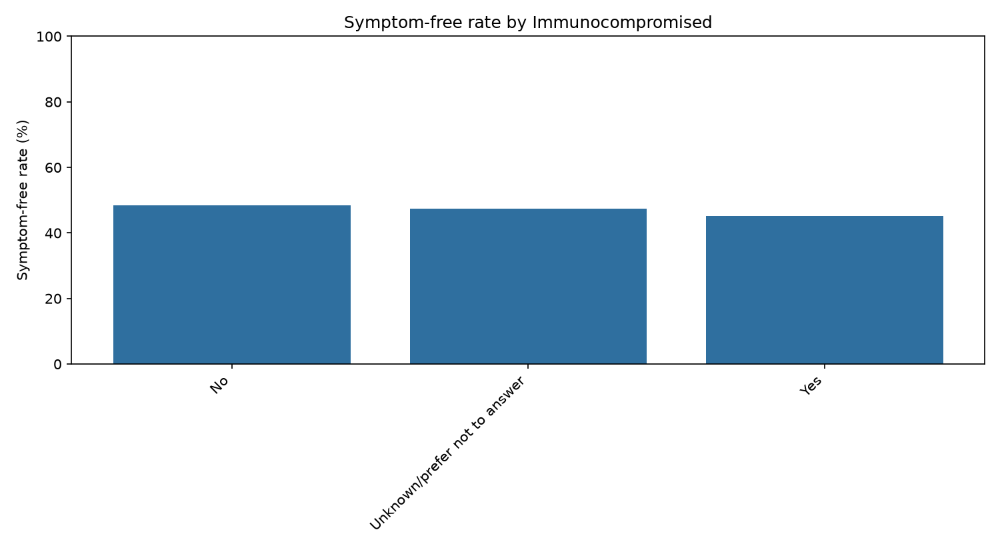
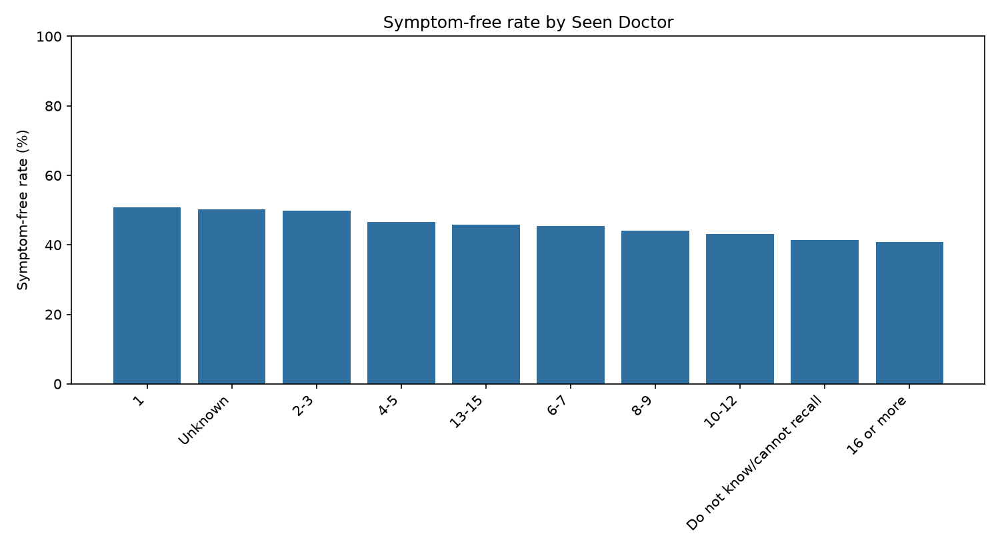
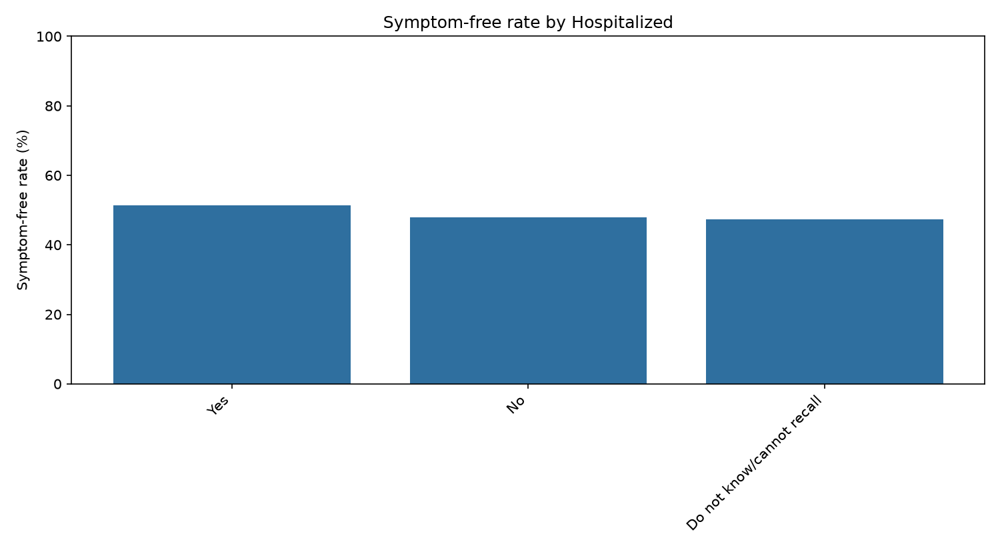
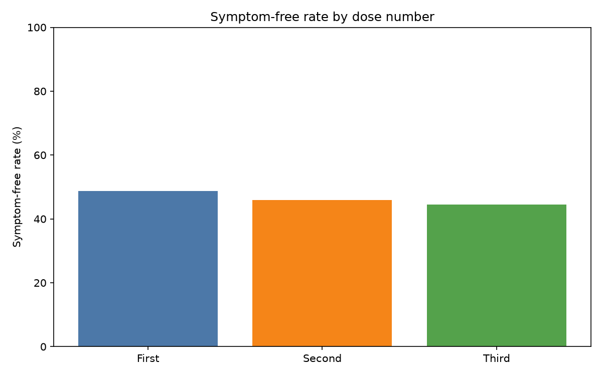
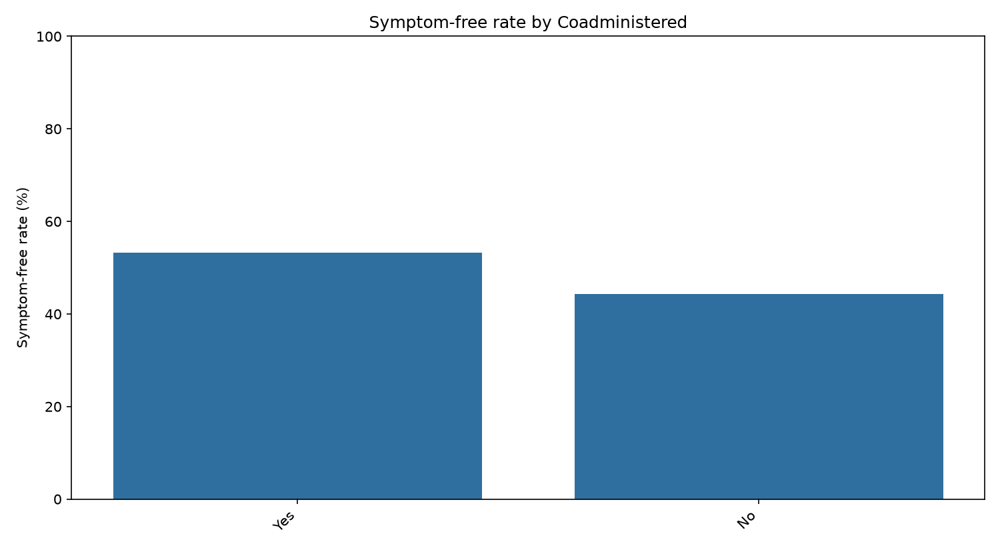
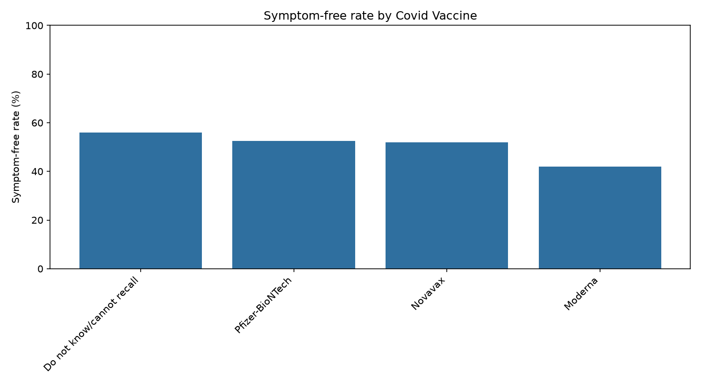
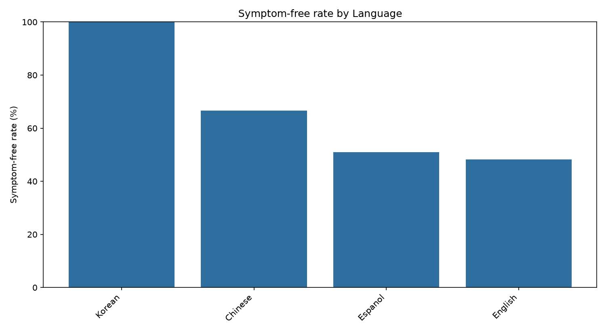

## Covariate efficacy effects

This page shows one efficacy-effect chart per available covariate. The outcome proxy is a symptom-free indicator derived from the daily survey data, and each bar reports the average symptom-free rate within that covariate group.

> Note: the provided CSV files do not contain a usable sex or gender column, so no real sex-based chart can be produced from this dataset without an additional source variable.

### Manufacturer

### Age group

### Current health state

### Immunocompromised status

### Doctors seen

### Hospitalization

### Dose number

### Co-administered vaccine

### COVID vaccine

### Language

### Notes

- These charts are exploratory and use a symptom-free proxy as the efficacy outcome.
- A true sex covariate would require a sex/gender field in the underlying dataset.
