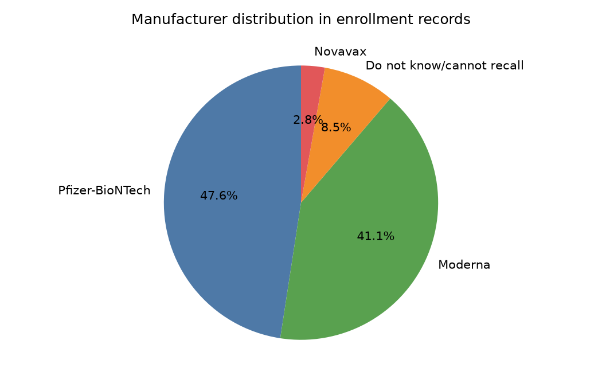

## Overview

This site now presents a small, data-backed snapshot of the vaccination records available in the repository.

### Verified dataset summary

| File | Record count |
| --- | ---: |
| `covid_enrollment.csv` | 91,379 |
| `covid_vaccination.csv` | 91,216 |
| `covid_daily_survey.csv` | 139,421 |
| `covid_weekly_survey.csv` | 220,416 |

### Most common vaccine manufacturers

| Manufacturer | Record count |
| --- | ---: |
| Pfizer-BioNTech | 43,480 |
| Moderna | 37,599 |
| Do not know/cannot recall | 7,746 |
| Novavax | 2,554 |

### Dose distribution

| Dose number | Record count |
| --- | ---: |
| First | 81,832 |
| Second | 8,781 |
| Third | 590 |
| Fourth | 11 |
| Fifth | 2 |

### Charts

::: {layout-ncol="2"}

:::

### Trend summary

- Enrollment activity is concentrated in a handful of months rather than distributed evenly across the whole period.
- Pfizer-BioNTech and Moderna dominate the manufacturer mix in the submitted enrollment records.
- Most vaccination entries are tied to first or second doses, which suggests a strong early-series reporting pattern in the data.
